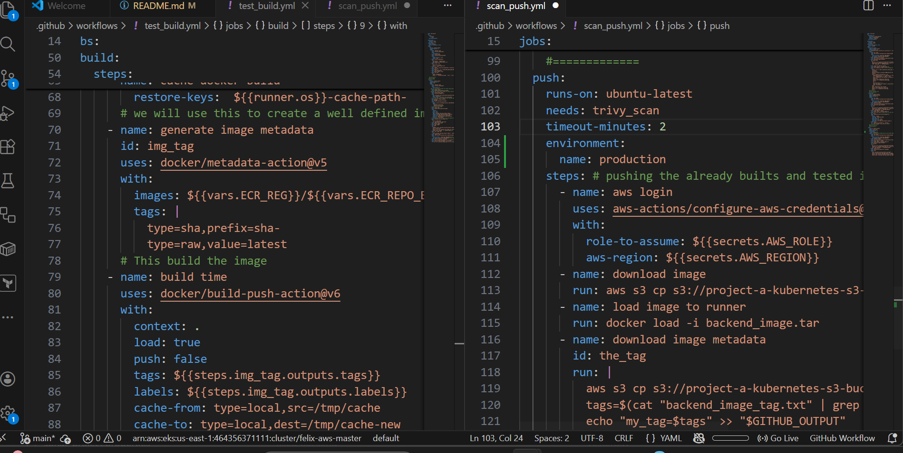
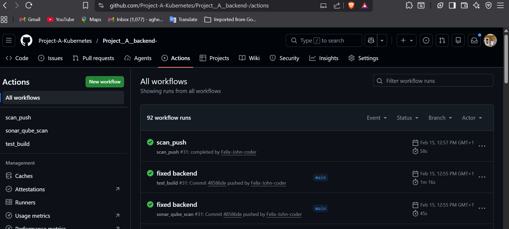
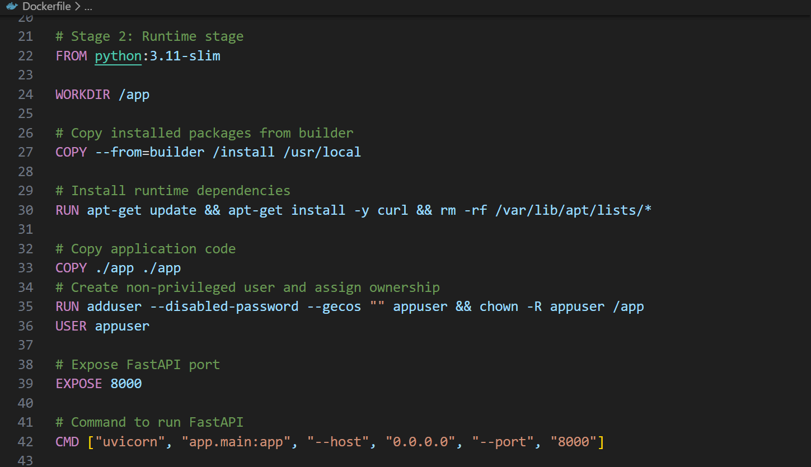

# Project A -  Backend

## Project Overview

This is a backend service providing </functionality> to my frontend. This system help track jobs, add jobs, delete jobs, change job statue and jobs states and data are store in RDS mysql database.
The service is fully containerized with Docker, automated through a CI/CD pipeline, and is designed for deployment on Kubernetes, ensuring scalability, availability, and maintainability, This system is built with security as a top priority.

## Architecture

    [Git Repository(Push)] 
        |
        v
    [CI/CD Pipeline (GitHub Actions)]
        |
        v
    [Docker Test, Build, Scan, Push to Registry and Update Helm Chart Repository ]
        |
        v
    [Kubernetes Cluster Argocd Deploy(Staging or Production)]
        |
        v
    [Monitoring & Logging (Prometheus / Grafana / ELK)]
## Key Points:

    - Multi-environment deployment (dev, staging, prod)
    - Automated build, test, scan, and deployment
    - Container orchestration with Kubernetes


## CI/CD Pipeline

The CI/CD pipeline ensures secure automated testing ,code quality check, sonar-qube scaning,  container building, integration test, push and deployment with Gitops.

Pipeline Steps:

- Checkout code from Git repository
- Run linting and unit tests 
- trivy security FS scan
- sonar-qube code quality scan
- Build Docker image
- integration scan  
- trivy image security scan
- Push Docker image to registry (On approval, push to ECR)
- update Backend Helm Chart 
- On approval, deploy to environment
- Deploy to staging or prod cluster using Gitop practice (argocd)

### Example GitHub Actions Workflow:

### picture of a successful CICD 

## Containerization

### Dockerfile Highlights:

-   Multi-stage build for small image size
-   Exposes port 8000
-   Supports environment variables for configuration and database connection(k8s secret operator)
-   Health checks for container readiness and liveness (used by kubernetes probes)

### Example Dockerfile snippet:



## Configuration & Secrets
    
-   Environment variables used for database URL and service credentials
-   Secrets stored securely in <AWS Secrets Manager / Kubernetes Secrets>
-   configuration injected with kubernetes secret operator dynamically
-   workflow secrets are stored in github secrets 
-   configured a role for short live access to aws

## Kubernetes Deployment

#### Next steps production deployment on Kubernetes:

-   Define deployment, service and other resources manifests with Helm
-   Use ConfigMaps and Secrets for environment-specific configurations
-   Setup auto-scaling and rolling updates for zero downtime
-   Setup canary deployment
-   Monitoring with Prometheus/Grafana/alertmanager 

> **Note:** Check [`project-a-backend-helm-chart` for more](https://github.com/Project-A-Kubernetes/-Project_A_helm_chart_backend.git) for the backend Helm chart.


##  Running Locally (DevOps Perspective)
```
    # clone the repo to your local machine
     git clone https://github.com/Project-A-Kubernetes/Project__A__backend-.git 
    # change directory 
    cd Project__A__backend-
    # Build Docker image
    docker build -t backend:latest .

    # Run container locally
    docker run -p 8000:8000 --name back backend:latest

    # Check logs
    docker logs -f back
```